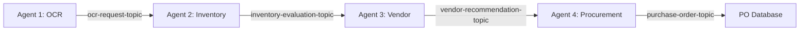

# 🚀 ProcureFlow — AI-Powered Multi-Agent Procurement System

<div align="center">


**A production-grade intelligent procurement system powered by autonomous AI agents**

[Features](#-features) • [Architecture](#-architecture) • [Quick Start](#-quick-start) • [Documentation](#-documentation) • [Demo](#-demo)

</div>

---

## 📋 Table of Contents

- [Overview](#-overview)
- [Key Features](#-features)
- [System Architecture](#-architecture)
- [Technology Stack](#-technology-stack)
- [Prerequisites](#-prerequisites)
- [Quick Start](#-quick-start)
- [Agent Pipeline](#-agent-pipeline)
- [API Documentation](#-api-documentation)
- [Frontend Dashboard](#-frontend-dashboard)
- [Configuration](#-configuration)
- [Troubleshooting](#-troubleshooting)
- [Contributing](#-contributing)
- [License](#-license)

---

## 🎯 Overview

ProcureFlow is a **fully automated procurement system** where AI agents handle the entire procurement pipeline — from document OCR to purchase order generation — without ever directly accessing databases. Built on **microservices architecture** with **event-driven communication** via Kafka.

### Core Principle

```
✅ Agents NEVER access databases directly
✅ Agents ONLY communicate via REST APIs
✅ All databases hidden behind service layers
✅ Inter-agent communication via Kafka events
✅ Real-time monitoring and observability
```

---

## ✨ Features

### 🤖 Intelligent Automation
- **4 Autonomous AI Agents** working in pipeline
- **OCR + LLM** for document intelligence
- **Automatic industry detection** from item descriptions
- **Multi-criteria vendor scoring** (rating, price, lead time)
- **Real-time workflow tracking** with live updates

### 🏗️ Enterprise Architecture
- **Microservices-based** design for scalability
- **Event-driven** communication via Apache Kafka
- **Multi-database** support (PostgreSQL + MySQL)
- **Redis caching** for performance optimization
- **API Gateway** pattern with centralized routing

### 📊 Professional Dashboard
- **Real-time agent monitoring** with live status
- **Workflow visualization** with progress tracking
- **Agent logs viewer** with event filtering
- **Purchase order management** with approvals
- **Data source configuration** for multi-industry support

### 🔐 Security & Compliance
- **API key authentication** for all services
- **No direct database access** from agents
- **Audit trail** for all procurement actions
- **Role-based access control** (planned)

---

## 🏛️ Architecture

### High-Level System Design

```
┌─────────────────────────────────────────────────────────────────┐
│                    FRONTEND DASHBOARD (Next.js)                 │
│                      http://localhost:3000                       │
│         • Agent Monitor  • Workflows  • Logs  • Reports         │
└──────────────────────────┬──────────────────────────────────────┘
                           │
┌──────────────────────────▼──────────────────────────────────────┐
│               INTEGRATION API GATEWAY (FastAPI)                 │
│                      http://localhost:8000                       │
│           • Centralized Routing  • Redis Cache  • Auth          │
└──┬───────────────────┬────────────────────┬─────────────────────┘
   │                   │                    │
┌──▼─────────┐  ┌──────▼──────┐  ┌─────────▼──────┐
│OCR Service │  │   Inventory  │  │  Vendor Service│
│ (Agent 1)  │  │   Service    │  │                │
│  :8001     │  │    :8002     │  │     :8003      │
└────────────┘  └──────────────┘  └────────────────┘
       │               │                    │
┌──────▼───────────────▼────────────────────▼─────────────────────┐
│                        DATA LAYER                                │
│  PostgreSQL (6 DBs)              MySQL (4 DBs)                  │
│  • ocr_procurement_db            • pharma_inventory_db          │
│  • construction_*                • pharma_vendor_db             │
│  • manufacturing_*               • electronics_inventory_db     │
│  • procurement_db                • electronics_vendor_db        │
└──────────────────────────────────────────────────────────────────┘

                     KAFKA EVENT STREAMING
┌──────────┐   ┌──────────┐   ┌──────────┐   ┌──────────┐
│ Agent 1  │──▶│ Agent 2  │──▶│ Agent 3  │──▶│ Agent 4  │
│   OCR    │   │Inventory │   │  Vendor  │   │Procurement│
│  :8009   │   │  :8005   │   │  :8006   │   │  :8008   │
└──────────┘   └──────────┘   └──────────┘   └──────────┘
     │              │              │              │
  ocr-req      inventory-      vendor-       purchase-
   topic       eval-topic    recommend-      order-
                                topic         topic
```

### Event Flow Pipeline



---

## 🛠️ Technology Stack

### Backend
- **Python 3.11** - Core agent logic
- **FastAPI** - REST API framework
- **Apache Kafka** - Event streaming
- **Redis** - Caching layer
- **PostgreSQL** - Primary database
- **MySQL** - Secondary database
- **Docker** - Containerization

### Frontend
- **Next.js 14** - React framework
- **TypeScript** - Type safety
- **TanStack Query** - Data fetching
- **Tailwind CSS** - Styling
- **Zustand** - State management
- **Lucide Icons** - Icon library

### Infrastructure
- **Docker Compose** - Orchestration
- **MinIO** - Document storage
- **Zookeeper** - Kafka coordination

---

## 📦 Prerequisites

Before you begin, ensure you have:

- ✅ **Docker Desktop** installed and running
- ✅ **Git** for cloning the repository
- ✅ **8GB RAM minimum** (16GB recommended)
- ✅ **20GB free disk space**

### Port Requirements

The following ports must be available:

| Port | Service |
|------|---------|
| 3000 | Frontend Dashboard |
| 5432 | PostgreSQL |
| 3306 | MySQL |
| 6379 | Redis |
| 8000 | API Gateway |
| 8001-8009 | Microservices & Agents |
| 9000-9001 | MinIO |
| 29092 | Kafka |

---

## 🚀 Quick Start

### 1. Clone the Repository

```bash
git clone https://github.com/ashleyworkbench/Multi-agent-procurement-system.git
cd Multi-agent-procurement-system
```

### 2. Launch the System (One-Command Startup)

#### 🐧 On Linux / macOS:
```bash
chmod +x start.sh stop.sh test-system.sh
./start.sh
```

#### 🪟 On Windows (PowerShell):
```powershell
.\start.ps1
```

#### 🪟 On Windows (Command Prompt):
```cmd
start.bat
```

> **Note**: The startup scripts will automatically copy `.env.example` to `.env` if it does not already exist, start the infrastructure databases, brokers, microservices, AI agents, and frontend dashboard in order, waiting for dependencies to report healthy!

---

### 3. Verify Health & Status

#### 🐧 On Linux / macOS:
```bash
./test-system.sh
```

#### 🪟 On Windows (PowerShell):
```powershell
.\test-system.ps1
```

#### 🪟 On Windows (Command Prompt):
```cmd
test-system.bat
```

---

### 4. Stop the System

#### 🐧 On Linux / macOS:
```bash
./stop.sh
```

#### 🪟 On Windows (PowerShell):
```powershell
.\stop.ps1
```

#### 🪟 On Windows (Command Prompt):
```cmd
stop.bat
```

---

### 5. Access the Web Dashboard

Open your browser at:
```
http://localhost:3000
```
- **API Gateway**: `http://localhost:8000`
- **MinIO Storage Console**: `http://localhost:9001` (User: `minioadmin`, Pass: `minioadmin`)

---

## 🤖 Agent Pipeline

### Agent 1: Document Intelligence (OCR + LLM)
**Port:** 8009  
**Purpose:** Extract procurement data from documents

**Capabilities:**
- OCR processing with Tesseract/Gemini Vision
- LLM-powered data extraction
- Stores requests in `ocr_procurement_db`
- Publishes to `ocr-request-topic`

**API:**
```bash
GET  /health
GET  /requests
GET  /requests/{id}
POST /upload
```

---

### Agent 2: Inventory Intelligence
**Port:** 8005  
**Purpose:** Evaluate inventory availability

**Process:**
1. Consumes from `ocr-request-topic`
2. Auto-detects industry from item keywords
3. Queries inventory via Integration Gateway
4. Calculates shortages and costs
5. Publishes to `inventory-evaluation-topic`

**Manual Test:**
```bash
curl -X POST http://localhost:8005/evaluate/1
```

**Response:**
```json
{
  "request_id": 1,
  "total_items": 5,
  "shortage_items": 2,
  "total_shortage_cost": 15000.00,
  "all_items_available": false,
  "items": [...]
}
```

---

### Agent 3: Vendor Intelligence
**Port:** 8006  
**Purpose:** Recommend optimal vendors

**Scoring Algorithm:**
```
Score = (0.40 × Rating) + (0.35 × PriceScore) + (0.25 × LeadTimeScore)
```

**Process:**
1. Consumes from `inventory-evaluation-topic`
2. Queries vendors via Integration Gateway
3. Scores all vendors per item
4. Selects best vendor
5. Publishes to `vendor-recommendation-topic`

**Manual Test:**
```bash
curl -X POST http://localhost:8006/recommend \
  -H "Content-Type: application/json" \
  -d @agent2_response.json
```

---

### Agent 4: Procurement Agent
**Port:** 8008  
**Purpose:** Generate purchase orders

**Process:**
1. Consumes from `vendor-recommendation-topic`
2. Creates PO for each recommended item
3. Calls Procurement Service API
4. Logs audit trail
5. Publishes to `purchase-order-topic`

**Manual Test:**
```bash
curl -X POST http://localhost:8008/process \
  -H "Content-Type: application/json" \
  -d @agent3_response.json
```

---

## 🌐 API Documentation

### Integration Gateway (Port 8000)

**Inventory Endpoints:**
```
GET /inventory/items?industry={industry}
GET /inventory/item/{name}?industry={industry}
```

**Vendor Endpoints:**
```
GET /vendors?industry={industry}
GET /vendors/item/{item_name}?industry={industry}
GET /vendors/{vendor_id}?industry={industry}
```

**Cache Management:**
```
DELETE /cache/flush
GET    /cache/stats
```

### Procurement Service (Port 8004)

```
GET    /purchase-orders
GET    /purchase-orders/{id}
PATCH  /purchase-orders/{id}/status
GET    /agent-logs
GET    /dashboard/summary
```

### Industry Configuration

| Industry | Engine | API Key Prefix |
|----------|--------|---------------|
| Construction | PostgreSQL | `CONST-` |
| Manufacturing | PostgreSQL | `MANUF-` |
| Pharmaceutical | MySQL | `PHARM-` |
| Electronics | MySQL | `ELEC-` |

---

## 💻 Frontend Dashboard

### Pages Overview

| Page | Route | Status | Description |
|------|-------|--------|-------------|
| **Dashboard** | `/` | ✅ Live | KPIs, charts, agent status |
| **Agent Monitor** | `/agents` | ✅ Live | Real-time agent pipeline |
| **Agent Logs** | `/agent-logs` | ✅ Live | Kafka event viewer |
| **Workflows** | `/workflows` | ✅ Live | Request tracking |
| **Purchase Orders** | `/purchase-orders` | ✅ Live | PO management |
| **Approvals** | `/approvals` | ✅ Live | Approve/reject POs |
| **File Uploads** | `/file-uploads` | ✅ Live | CSV/XLSX onboarding |
| **Data Sources** | `/data-sources` | ✅ Live | Industry connections |
| **Inventory** | `/inventory` | ✅ Live | Stock viewer |
| **Vendors** | `/vendors` | ✅ Live | Vendor directory |

### Features

- **Real-time Updates** - Auto-refresh every 3-5 seconds
- **Live Agent Status** - See which agents are processing
- **Event Streaming** - Watch Kafka events in real-time
- **Workflow Tracking** - Follow requests through pipeline
- **Responsive Design** - Works on desktop and tablet

---

## ⚙️ Configuration

### Environment Variables

Key variables in `.env`:

```bash
# Database Credentials
POSTGRES_USER=procurement_admin
POSTGRES_PASSWORD=SecurePass@2024
MYSQL_ROOT_PASSWORD=RootPass@2024

# Redis
REDIS_PASSWORD=RedisPass@2024

# Kafka
KAFKA_BOOTSTRAP_SERVERS=kafka:9092

# MinIO (Document Storage)
MINIO_ACCESS_KEY=minioadmin
MINIO_SECRET_KEY=minioadmin

# API Keys
GATEWAY_KEY=GATEWAY-master-key-2024
OCR_KEY=OCR-e4b9f8e7-0756-4938-45ab-8abc67890123
PROCUREMENT_KEY=PROC-f3a8e7d6-9645-4827-34ab-7abc56789012
```

### Industry API Keys

Defined in `frontend/src/lib/api.ts`:

```typescript
export const INDUSTRY_API_KEYS = {
  construction:  "CONST-a8f3d2e1-...",
  pharma:        "PHARM-b7e2c1d0-...",
  manufacturing: "MANUF-c6d1b0e9-...",
  electronics:   "ELEC-d5c0a9f8-...",
};
```

---

## 🧪 Testing

### Run Full Pipeline

```bash
# Option 1: Via Frontend
# Go to http://localhost:3000/agents
# Click "Run Agents 2 → 3 → 4"

# Option 2: Via API
curl -X POST http://localhost:8005/trigger \
  -H "Content-Type: application/json" \
  -d '{"request_id": 1}'
```

### Check Purchase Orders

```bash
curl http://localhost:8004/purchase-orders \
  -H "X-API-KEY: PROC-f3a8e7d6-9645-4827-34ab-7abc56789012"
```

### View Agent Logs

```bash
curl http://localhost:8004/agent-logs \
  -H "X-API-KEY: PROC-f3a8e7d6-9645-4827-34ab-7abc56789012"
```

---

## 🐛 Troubleshooting

### Services Won't Start

```bash
# Check Docker is running
docker info

# Check port conflicts
netstat -ano | findstr :3000
netstat -ano | findstr :5432

# Restart everything
docker-compose down
docker-compose up -d --build
```

### Agent Not Processing

```bash
# Check agent status
curl http://localhost:8005/status

# Check Kafka connection
docker logs procurement_agent2 --tail 50

# Restart specific agent
docker restart procurement_agent2
```

### Database Connection Issues

```bash
# Check database health
docker logs procurement_postgres --tail 50
docker logs procurement_mysql --tail 50

# Verify databases initialized
docker exec -it procurement_postgres psql -U procurement_admin -l
```

### Frontend Build Fails

```bash
cd frontend
rm -rf .next node_modules
npm install
npm run build
```

---

## 📁 Project Structure

```
procureflow/
├── .env                          # Environment variables
├── .gitignore                    # Git ignore rules
├── docker-compose.yml            # Full system orchestration
├── README.md                     # This file
│
├── databases/                    # Database initialization
│   ├── postgres/
│   │   ├── Dockerfile
│   │   └── init/                 # SQL init scripts
│   └── mysql/
│       ├── Dockerfile
│       └── init/                 # SQL init scripts
│
├── services/                     # Microservices
│   ├── integration-gateway/      # API Gateway + Redis
│   ├── ocr-service/              # Agent 1 API
│   ├── inventory-service/        # Inventory API
│   ├── vendor-service/           # Vendor API
│   ├── procurement-service/      # PO management
│   ├── onboarding-service/       # CSV/XLSX upload
│   ├── agent1-ocr/               # OCR Agent
│   ├── agent2-inventory/         # Inventory Agent
│   ├── agent3-vendor/            # Vendor Agent
│   └── agent4-procurement/       # Procurement Agent
│
└── frontend/                     # Next.js Dashboard
    ├── src/
    │   ├── app/                  # Pages (App Router)
    │   ├── components/           # React components
    │   ├── lib/                  # API client & utils
    │   └── store/                # State management
    ├── public/                   # Static assets
    ├── Dockerfile
    └── package.json
```

---

## 🤝 Contributing

Contributions are welcome! Please follow these steps:

1. Fork the repository
2. Create a feature branch (`git checkout -b feature/amazing-feature`)
3. Commit your changes (`git commit -m 'Add amazing feature'`)
4. Push to the branch (`git push origin feature/amazing-feature`)
5. Open a Pull Request

### Development Guidelines

- Follow existing code style
- Add tests for new features
- Update documentation
- Ensure all services pass health checks

---

## 📄 License

This project is licensed under the MIT License - see the [LICENSE](LICENSE) file for details.

---

## 🙏 Acknowledgments

- Built with FastAPI, Next.js, and Apache Kafka
- Inspired by microservices and event-driven architecture patterns
- Designed for enterprise-grade procurement automation

---

## 📞 Support

For issues, questions, or suggestions:

- 🐛 **Bug Reports:** [GitHub Issues](https://github.com/yourusername/procureflow/issues)
- 💬 **Discussions:** [GitHub Discussions](https://github.com/yourusername/procureflow/discussions)
- 📧 **Email:** support@procureflow.com

---

<div align="center">

**Made with ❤️ for intelligent procurement automation**

⭐ Star this repo if you find it helpful!

</div>
